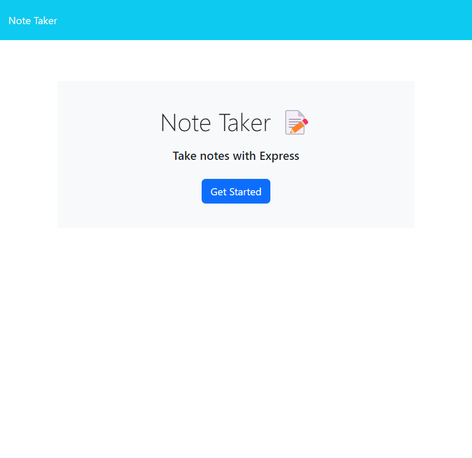
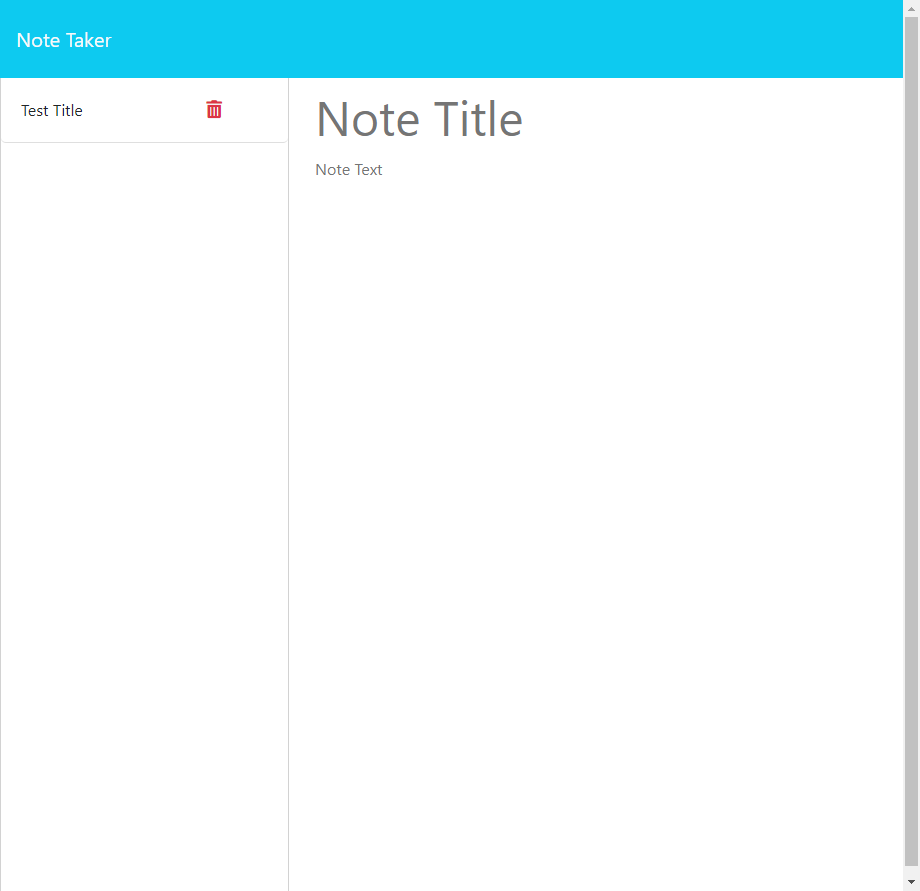

# Note Taker

Oriented towards anyone with a busy schedule, this application allows the user to write and save notes in order to organize one's thoughts and to-do list. 

This application features an Express.js backend and saves and retrieves note data via a JSON file. 

## Usage

The note taker can be accessed [here](https://sheltered-plains-05711-39d7f6bd52f2.herokuapp.com/).

Previews can be seen below:

## Contributions

The frontend starter code for this project was originally created by [Xandromus](https://github.com/Xandromus), [nol166](https://github.com/nol166), and [Georgeyoo](https://github.com/Georgeyoo), and can be accessed [here](https://github.com/coding-boot-camp/miniature-eureka).
